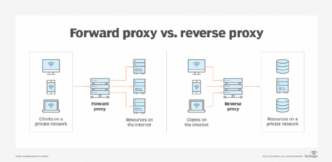

## Summary

Here I will implement a reverse proxy in Golang from scratch without tutorials. ie. it won't be good but I want to practice concurrency & my golang. Furthermore, I will later use this proxy to create a gRPC loadbalancer

See my progress in branch: https://github.com/Unbounder1/build-my-own-x/tree/proxy